> clone the git repo 

```bash
git clone https://github.com/surendraboyapati/Dev.git
```
# #1 Packer Images

> run the packer images

* Linux image

```bash
packer build PackerLinux.json
```

* Linux with Ansible image

```bash
packer build PackerLinux.json
```
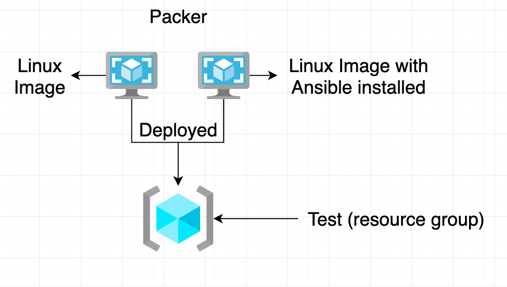

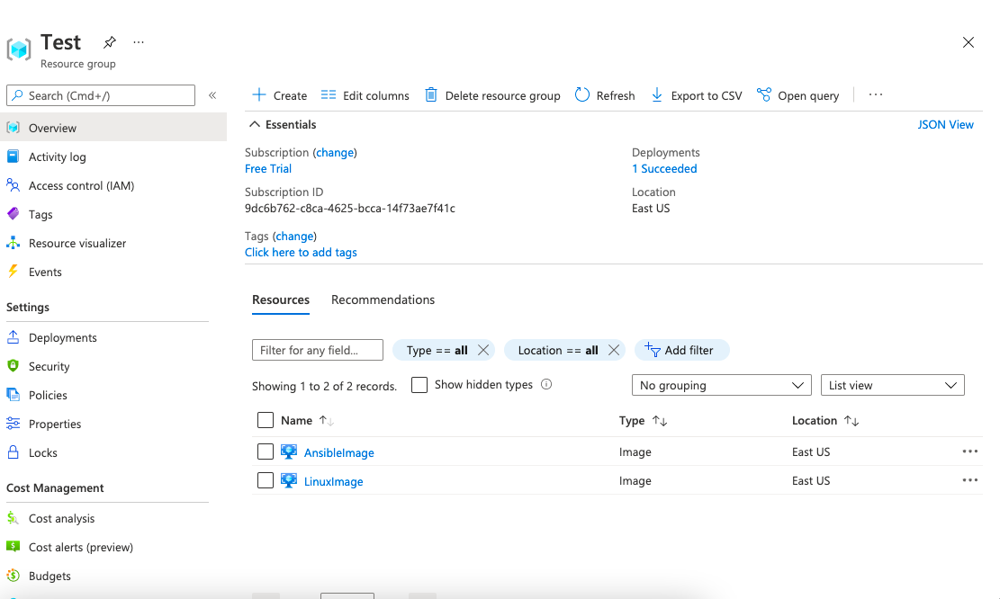

# #2 Terraform 

> Run terraform script from Dev Dir

```bash
terraform plan

terraform apply

terraform show
```
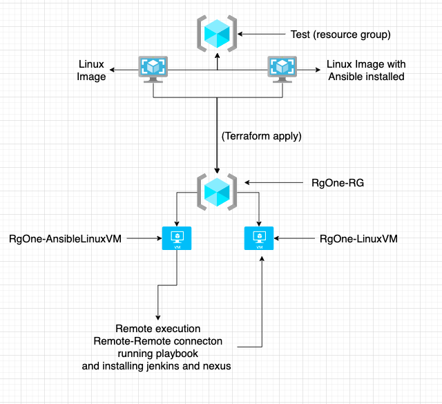

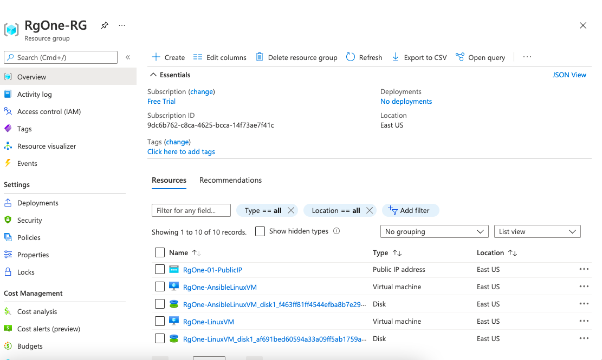

# #3 Jenkins and nexus(CI and CD)

> jenkins
 * check the Dev/publicIp.txt file(executed from terraform)
```
http://52.190.56.78:8080/
```

> nexus 

* in nexus setup your passowrd as admin123(otherwise you need to change the settings.xml in spring-petclinic application)

```
http://52.190.56.78:8081/
```

> jar application (running locally)

* go to this website after first jenkins job

* changed port number to 8082(default 8080)  in application-properties in spring-petclenic dir
```
http://52.190.56.78:8082/
```

> jenkins required plugins
```
Strict Crumb Issuer
Nexus Artifact Uploader
Nexus Platform Plugin
```
> jenkins pipeline 

* create a pipeline with Test1(because automated scripts uses this file convenction )

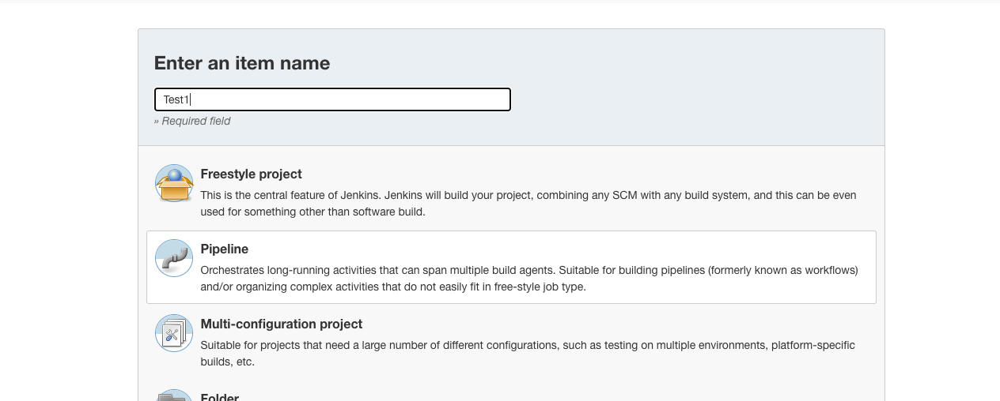

* the below script executs on jenkins pipeline stops previous application(jar) and execute current build application(jar).

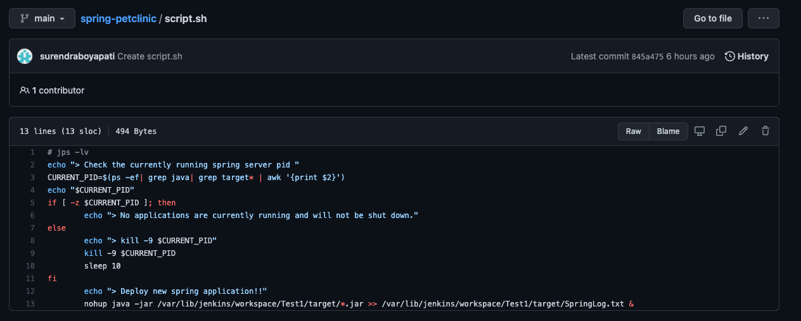

* setup the jenkins pipelie with SCM

```
https://github.com/surendraboyapati/jenkins.git

branch : main

file : Jenkinsfile
```

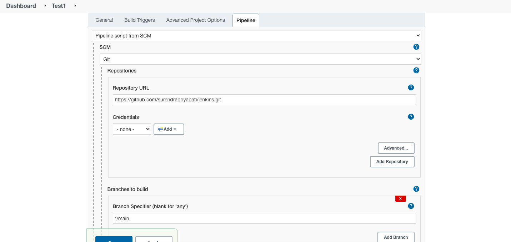

* update ip address in required fields(jenkins Pipeline File), pom.xml

> first build

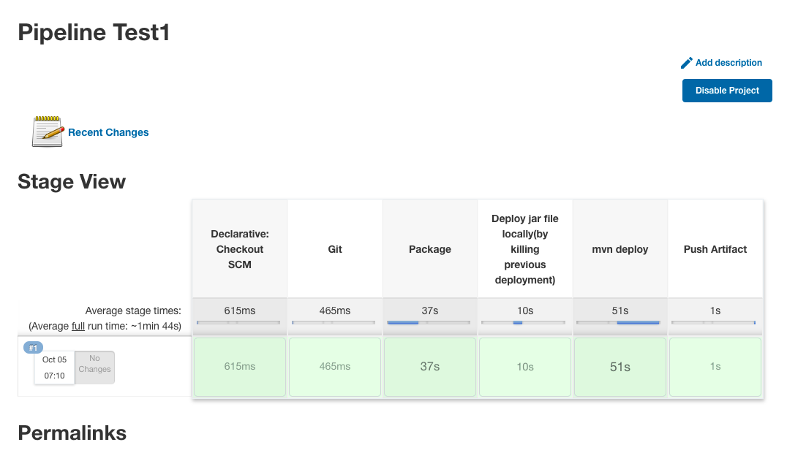

> verify your application and deployment

```
jar application 

http://52.190.56.78:8082/

nexus 
http://52.190.56.78:8081/

jenkins
http://52.190.56.78:8080/

```
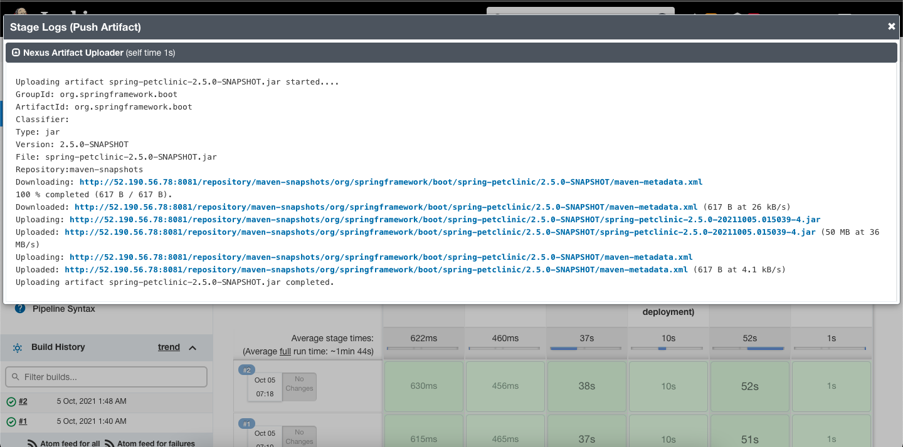

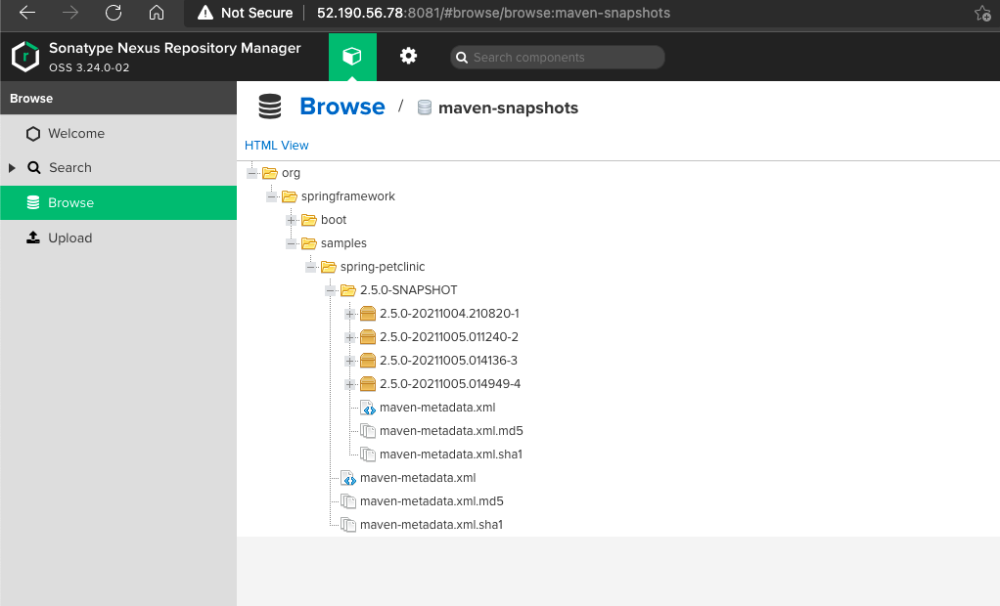

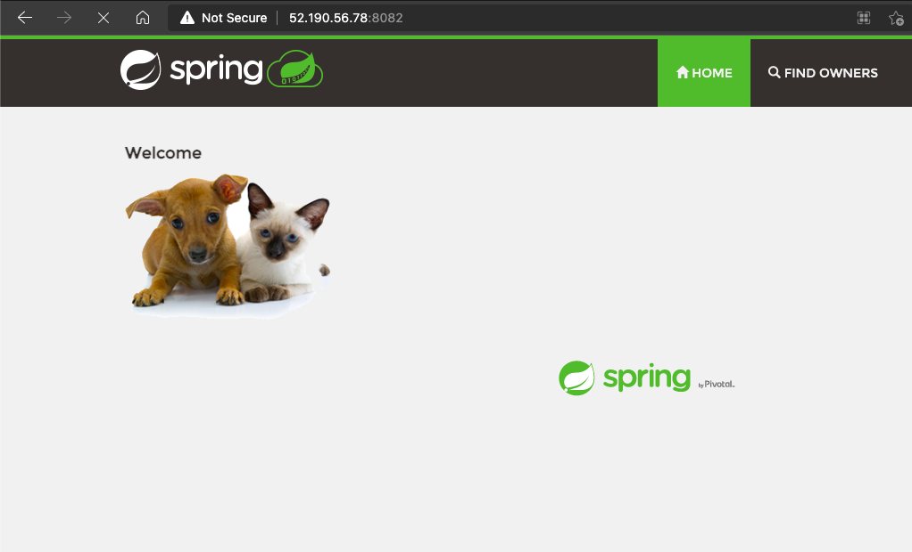

> build the jenkins job and get updated html in your app.

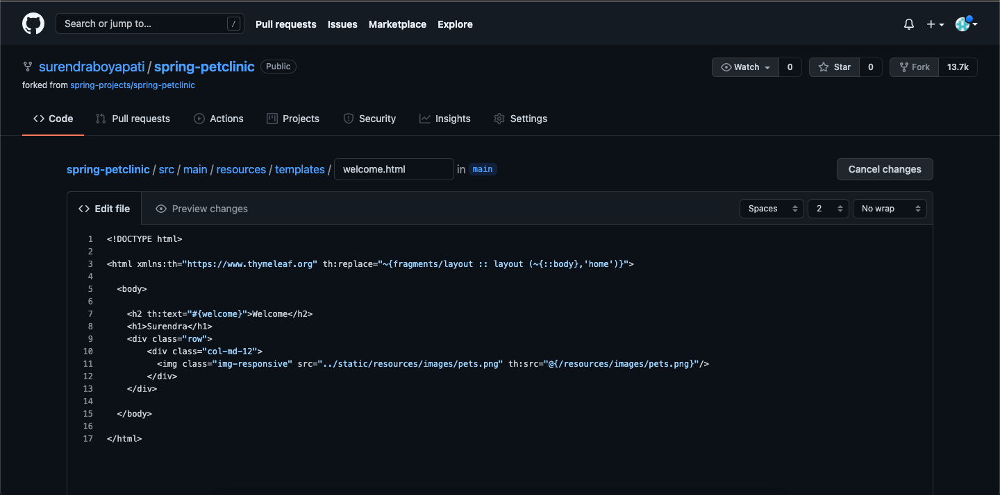

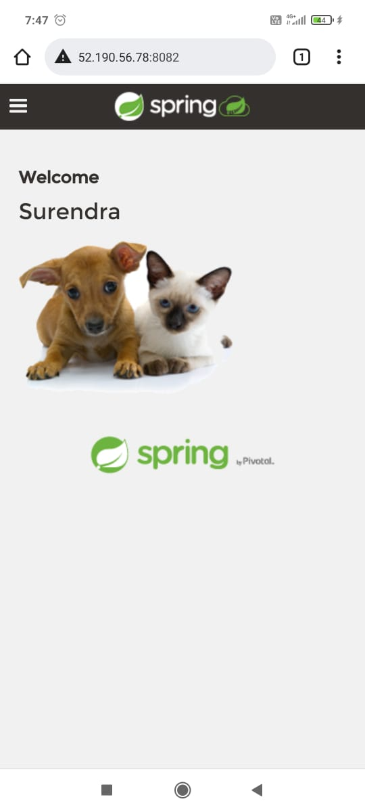

* finally arrifacts uploaded to nexus server

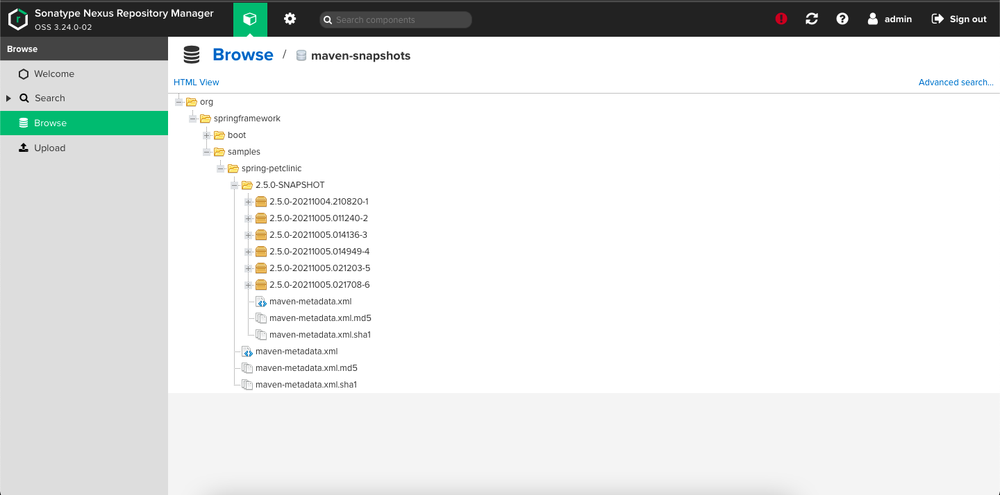

> de-provision the environment 

```
terraform destroy
```